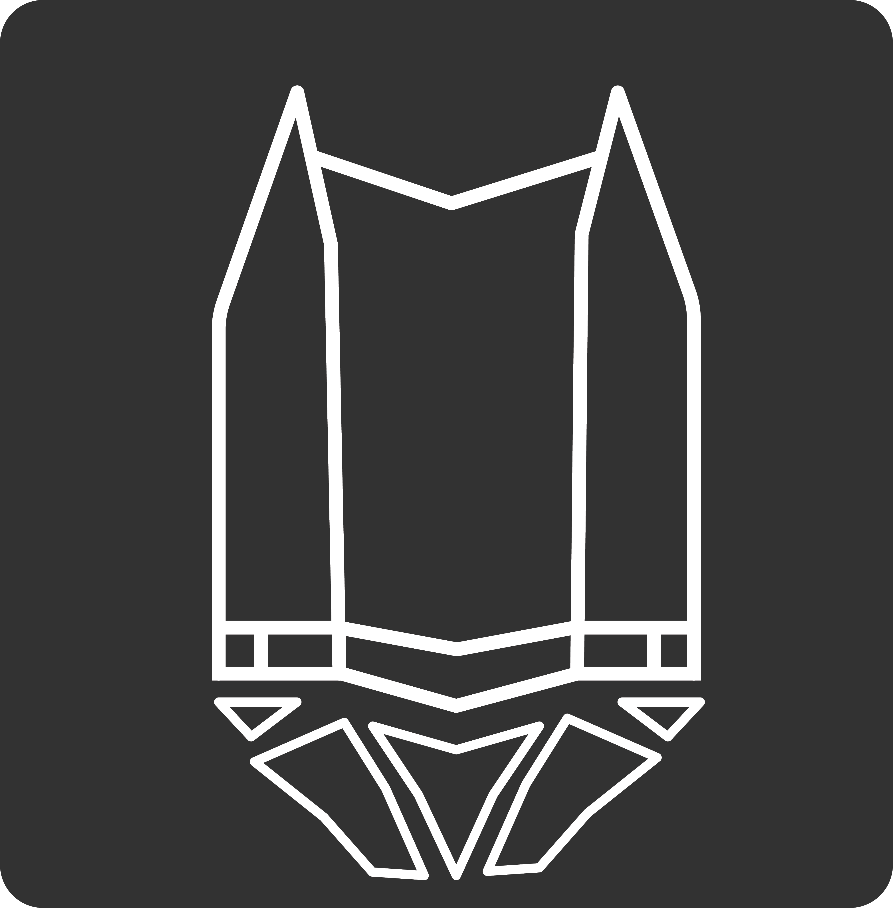
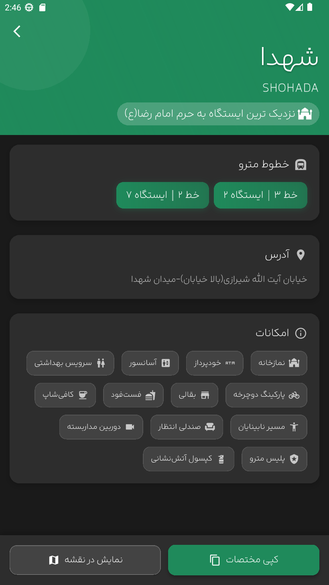
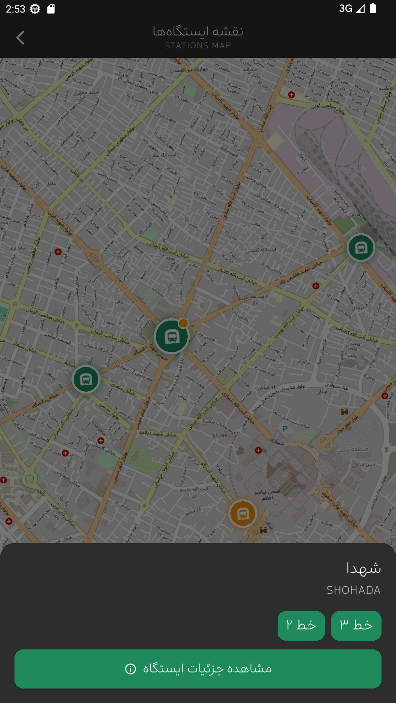

<div align="center">

# 🚇 Mashhad Metro

<figure>
  
</figure>

### A comprehensive guide to navigate Mashhad Metro system effortlessly


[](https://dart.dev/)
[](https://flutter.dev/)
[](https://riverpod.dev)
[](https://www.openstreetmap.org)
[](https://www.gnu.org/licenses/gpl-3.0)

[Features](#-features) • [Screenshots](#-screenshots) • [Download](#-download) • [Build](#-build-from-source) • [Contributing](#-contributing) • [License](#-license)

</div>

---

## 📖 About

**Mashhad Metro** is a free and open-source mobile application designed to help residents and pilgrims navigate the Mashhad Metro system with ease. Built with Flutter, this app provides comprehensive information about all metro stations, lines, facilities, and real-time navigation assistance.

**Data Source:** This application uses metro station data from the [mashhad-metro-data](https://github.com/shahriaarrr/mashhad-metro-data) repository, which maintains accurate and up-to-date information about the Mashhad Metro system.

Whether you're a daily commuter or visiting the holy city for the first time, Mashhad Metro is your essential companion for exploring the city's metro network.

---

## ✨ Features

- 🗺️ **Interactive Map** - View all metro stations on an interactive map with zoom and navigation capabilities
- 📍 **Complete Station Information** - Access detailed information for each station including addresses and exact locations
- 🏢 **Facilities Finder** - Easily locate stations with specific amenities (elevators, restrooms, WiFi, parking, etc.)
- 🚉 **Multi-Line Support** - Browse all metro lines and identify interchange stations seamlessly
- 📱 **Offline Access** - Use all station information without an internet connection
- 🎨 **Modern UI/UX** - Clean, intuitive interface with dark mode support
- ♿ **Accessibility** - Designed for users of all ages and abilities
- 🆓 **100% Free & Open Source** - No ads, no tracking, no hidden costs

---

## 📱 Screenshots

<div style="display: flex; overflow-x: auto; gap: 12px; padding: 8px 0;">
  
  
  
  
  
</div>

---

<!-- ## 📥 Download

| Platform   | Myket | Bazaar | Anardoni | F-Droid | GitHub Releases |
|------------|:----------:|:-------:|:---------:|:-------:|:---------------:|
| Android    | coming soon... | []() | - | []() | [](https://github.com/shahriaarrr/mashhad_metro/releases) |
| iOS        | - | - | []() | - | [](https://github.com/shahriaarrr/mashhad_metro/releases) |

--- -->

## 🛠️ Build from Source

### Prerequisites

Before you begin, ensure you have the following installed:
- [Flutter SDK](https://flutter.dev/docs/get-started/install) (3.0.0 or higher)
- [Android Studio](https://developer.android.com/studio) or [Xcode](https://developer.apple.com/xcode/) (for iOS)
- [Git](https://git-scm.com/)

### Steps

1. **Clone the repository**
```bash
   git clone https://github.com/shahriaarrr/mashhad-metro.git
   cd mashhad-metro
```

2. **Install dependencies**
```bash
   flutter pub get
```

3. **Run the app in debug mode**
```bash
   flutter run
```

4. **Build for Android (APK)**
```bash
   flutter build apk --release
```
   The APK file will be located at: `build/app/outputs/flutter-apk/app-release.apk`

5. **Build for Android (App Bundle)**
```bash
   flutter build appbundle --release
```
   The AAB file will be located at: `build/app/outputs/bundle/release/app-release.aab`

6. **Build for iOS** (macOS only)
```bash
   flutter build ios --release
```

### Build Configuration

To customize the build, you can modify the following files:
- `android/app/build.gradle` - Android build configuration
- `ios/Runner.xcodeproj` - iOS build configuration
- `pubspec.yaml` - Project dependencies and metadata

---

## 🎨 Design Credits

**App Icon Design:** [Sajjad Khiabani](https://github.com/sajadkhiabani)

A special thanks to Sajjad for creating the beautiful and modern app icon that perfectly represents the spirit of Mashhad Metro.

---
## ⚠️ Found Incorrect Metro Data?

>[!WARNING]
> **Important Notice**  
> If you notice any incorrect or outdated information about metro stations, facilities, or routes, please **DO NOT** report it here.  
> 
> All metro data is maintained in a separate repository:  
> 👉 **[mashhad-metro-data](https://github.com/shahriaarrr/mashhad-metro-data)**
> 
> Please report data issues or submit corrections there. This helps keep the data accurate for all applications that use it.

---
## 🤝 Contributing

Contributions are welcome! Whether it's bug reports, feature requests, or code contributions, we appreciate your help in making Mashhad Metro better.

### How to Contribute

1. Fork the repository
2. Create your feature branch (`git checkout -b feature/AmazingFeature`)
3. Commit your changes (`git commit -m 'Add some AmazingFeature'`)
4. Push to the branch (`git push origin feature/AmazingFeature`)
5. Open a Pull Request

Please read our [Contributing Guidelines](CONTRIBUTING.md) for more details.

---

## 💖 Credits

The user interface of this project was inspired by the beautiful design of the **[Tehran Metro App](https://github.com/mosayeb-a/tehran-metro)** created by **[@mosayeb-a](https://github.com/mosayeb-a)**.  

Their thoughtful approach to creating an intuitive and visually appealing metro navigation experience served as a foundation for this project's design language. We're grateful for their contribution to making public transportation more accessible through great design.

---

## 🐛 Bug Reports

If you encounter any issues, please [open an issue](https://github.com/shahriaarrr/mashhad-metro/issues) with:
- A clear description of the problem
- Steps to reproduce
- Expected vs actual behavior
- Screenshots (if applicable)
- Device information and OS version

---

## 📞 Contact

- **GitHub Issues:** [Report a bug or request a feature](https://github.com/shahriaarrr/mashhad-metro/issues)
- **Email:** shahriaarrr@gmail.com
- **Project Repository:** [github.com/shahriaarrr/mashhad-metro](https://github.com/shahriaarrr/mashhad-metro)

---

<div align="center">

Made with ❤️ for pilgrims and residents of Mashhad

**⭐ If you find this app helpful, please consider giving it a star on GitHub! ⭐**

</div>
